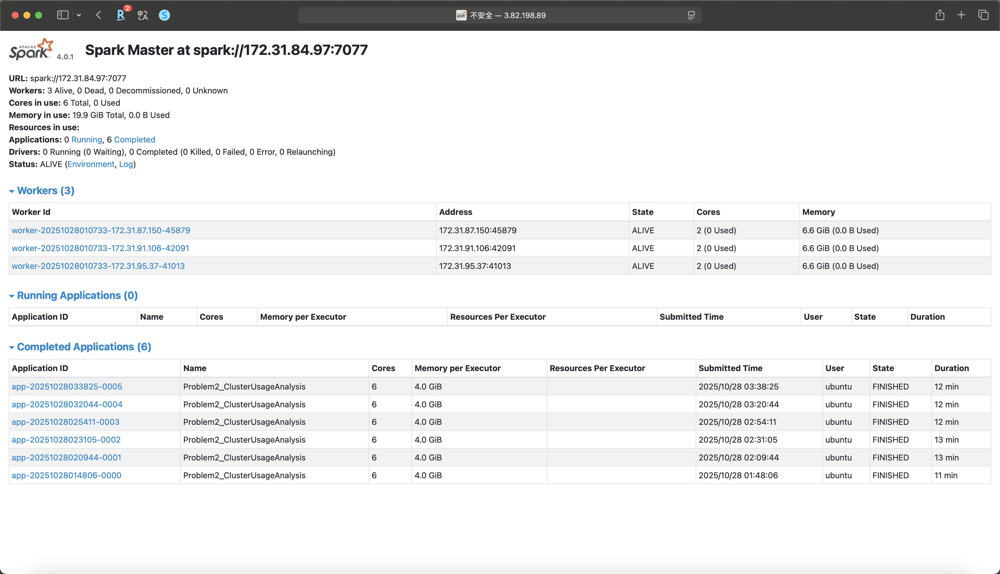

# Analysis Report

## Comprehensive analysis of findings

### Approach Overview

#### Problem 1 – Log Level Distribution
The goal for this problem is to analyze the distribution of log levels (INFO, WARN, ERROR, DEBUG) across all log files. The implementation used PySpark for distributed log processing, enabling efficient computation across large text datasets.

- Count log levels

In this task, we created a dataframe containing all possible log levels to guarantee that even levels with zero occurences would appear in the final output.
The main method is to apply groupBy and agg to get the number of logs in each log levels. There is a problem that DEBUG level has no log, therefore we need to create a dataframe with a defined column "log_level" with all 4 levels filled. The counts were then left-joined with the predefined list of levels, filled with zeros, and ordered logically (INFO → WARN → ERROR → DEBUG).

- Save 10 random sample log entries with their levels

To complement the quantitative data, 10 random log entries were selected for inspection. This sample helped verify that log parsing was correct and that the data distribution reflected realistic cluster behavior.

- Summary statistics

This script calculated the total number of processed lines, the total number of lines containing valid log levels, The number and percentage of each log level. The only difference of between this task and the first task that we need to calculate the percentage in addition.

*RESULT*

A total of 33,236,604 log lines were processed, out of which 27,410,336 (≈82%) contained identifiable log levels (INFO, WARN, ERROR, or DEBUG).

This indicates that the majority of logs followed a consistent format with recognizable severity markers — a sign of stable and standardized logging practices within the Spark cluster environment.

> - The overwhelming dominance of INFO messages (~99.9%) shows that the logs are primarily informational, capturing normal operational progress and system updates rather than problems or debug traces.
> 
> - Both WARN and ERROR messages are extremely rare (<0.05%), indicating high system stability and very few runtime anomalies or failures.
> 
> - The absence of DEBUG logs suggests that debug-level logging was disabled in the production environment — a deliberate configuration to avoid excessive log volume and I/O overhead in large-scale Spark clusters.

#### Problem 2: Cluster Usage Analysis

- Time-series data for each application

Each log line was scanned for a timestamp in the format yy/MM/dd HH:mm:ss.
After filtering valid timestamps, Spark aggregated the minimum and maximum timestamps for every application.
The resulting table represented the start-to-end lifetime of each Spark application.

- Aggregated cluster statistics

To evaluate how busy each cluster was, applications were grouped by cluster_id. This produced one summary row per cluster showing the number of applications and the timestamp of its first and last application.

- Overall summary statistics

The script computed global metrics including the total unique clusters, total applications, average applications per cluster, and a ranked list of the most heavily used clusters.

- Bar chart showing applications per cluster

This visualization displays the number of applications per cluster, with color-coded bars and numeric labels above each bar.
This provided an immediate overview of which clusters handled the heaviest workloads.

- Faceted density plots showing duration distribution per cluster

For the largest cluster, job durations were calculated as duration_sec = end_time − start_time.
Durations were plotted on a log-scaled x-axis, combining a histogram (count) with a red KDE curve computed in log-space for smoother visualization of heavy-tailed distributions.
This revealed the runtime variability of Spark jobs within that cluster.

*RESULT*

> - Among 6 clusters, one (1485248649253) handled 181 out of 194 applications (≈93%), clearly serving as the primary production cluster.
>
> - The main cluster was active for over six months, whereas smaller clusters operated for only a few hours or days.
>
> - The bar chart also shows an extremely skewed workload, dominated by a single cluster. This centralization simplifies operations but risks over-reliance on one environment.

---

### Performance analysis

Execution Times:
- Problem 1: 391.06 seconds
- Problem 2: 723.19 seconds

Problem 2 required nearly double the runtime of Problem 1, primarily due to its heavier aggregation workload and multiple visualization steps.
While Problem 1 mainly performed text parsing and counting operations, Problem 2 included timestamp extraction, time-series aggregation, cross-cluster statistics, and KDE-based plotting — all more computationally intensive tasks.

---

### Documentation quality

